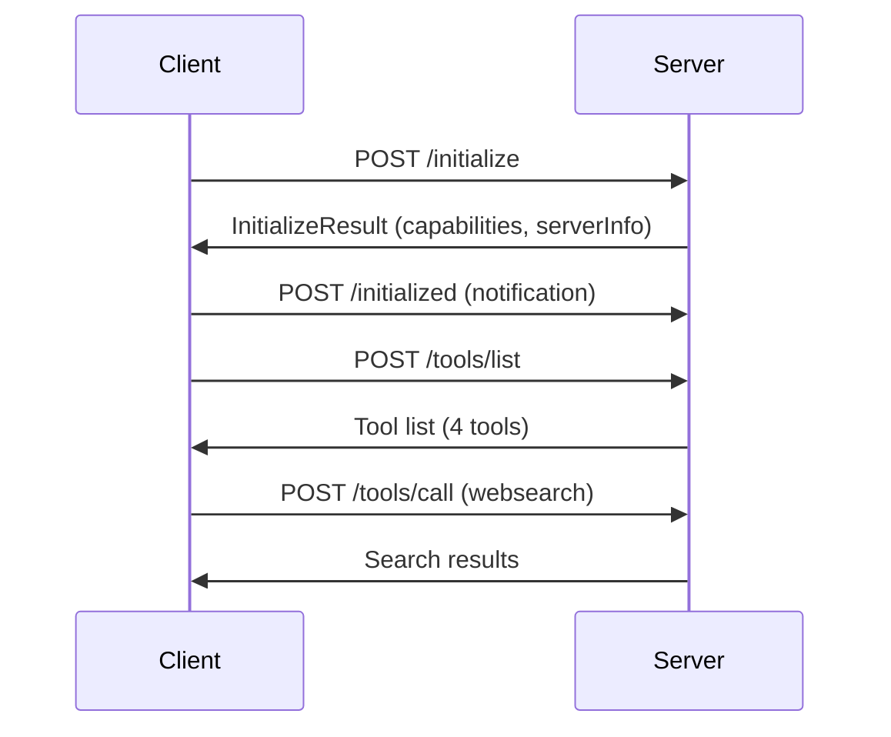

# 🏗️ Nuclear Crawler Hybrid - Architecture Documentation

## Overview

Nuclear Crawler Hybrid is a high-performance Model Context Protocol (MCP) server built in Rust, designed to provide advanced web search, deep web exploration, premium content extraction, and intelligent file analysis capabilities to AI assistants and development tools.

---

## Core Architecture

### Technology Stack

| Component | Technology | Purpose |
|-----------|-----------|---------|
| **Core Language** | Rust 1.75+ | Memory safety, performance, concurrency |
| **Async Runtime** | Tokio | Non-blocking I/O, task scheduling |
| **Web Framework** | Axum 0.6 | HTTP server, routing, middleware |
| **Protocol** | MCP 2025-01-01 | AI tool integration standard |
| **Transport** | HTTP + SSE | Request/response + streaming events |
| **Serialization** | serde_json | JSON encoding/decoding |

### System Components

```
┌────────────────────────────────────────────────────────┐
│                  MCP Client Layer                      │
│  (VS Code, Cursor, Windsurf, Claude Desktop)          │
└──────────────────────┬─────────────────────────────────┘
                       │ HTTP/SSE (Port 8079)
┌──────────────────────▼─────────────────────────────────┐
│              Axum Web Server (Rust)                    │
│  ┌────────────────────────────────────────────────┐   │
│  │         MCP Protocol Handler                   │   │
│  │  • JSON-RPC 2.0 request/response              │   │
│  │  • SSE for streaming notifications            │   │
│  │  • Tool discovery and invocation              │   │
│  └────────────────────────────────────────────────┘   │
└──────────────────────┬─────────────────────────────────┘
                       │
┌──────────────────────▼─────────────────────────────────┐
│                Tool Execution Layer                    │
│  ┌──────────┬──────────┬──────────┬──────────┐        │
│  │WebSearch │ DeepWeb  │ Premium  │   File   │        │
│  │  Tool    │   Tool   │   Tool   │ Search   │        │
│  └────┬─────┴────┬─────┴────┬─────┴────┬─────┘        │
│       │          │          │          │               │
│  ┌────▼──────────▼──────────▼──────────▼─────┐        │
│  │      Core Module Infrastructure            │        │
│  │  • Rate Limiting  • Caching  • Storage     │        │
│  │  • Error Handling • Metrics  • Logging     │        │
│  └────┬──────────┬──────────┬──────────┬─────┘        │
└───────┼──────────┼──────────┼──────────┼──────────────┘
        │          │          │          │
┌───────▼───┐  ┌──▼───┐  ┌───▼───┐  ┌──▼────┐
│  Go FFI   │  │ Zig  │  │  Nim  │  │  Jax  │
│100K Async │  │ SIMD │  │ HTML  │  │Vector │
└───────────┘  └──────┘  └───────┘  └───────┘
```

---

## MCP Protocol Implementation

### Protocol Version: 2025-01-01

Nuclear Crawler Hybrid implements the Model Context Protocol specification with HTTP transport.

#### Initialization Sequence



#### Request Format (JSON-RPC 2.0)

```json
{
  "jsonrpc": "2.0",
  "id": 1,
  "method": "tools/call",
  "params": {
    "name": "websearch",
    "arguments": {
      "queries": ["rust async programming"],
      "max_results": 100
    }
  }
}
```

#### Response Format

```json
{
  "jsonrpc": "2.0",
  "id": 1,
  "result": {
    "content": [
      {
        "type": "text",
        "text": "Search completed: 2,147 URLs found"
      }
    ],
    "isError": false
  }
}
```

---

## Tool Specifications

### 1. WebSearch Tool

**Purpose**: Massively parallel web search across 55+ search engines

**Timeout**: 5 seconds per query  
**Max Queries**: 50 concurrent queries  
**Parallelism**: 100K goroutines (via Go FFI)

#### Search Sources

| Category | Sources | Count |
|----------|---------|-------|
| **General Search** | DuckDuckGo, Bing, Brave, Yandex, Ecosia, Qwant, Startpage, Mojeek, Swisscows, SearX | 10+ |
| **Code Repositories** | GitHub, GitLab, Codeberg, Gitee, BitBucket, SourceForge, SourceHut | 7 |
| **Developer Communities** | Stack Overflow, Reddit (12 tech subreddits), Dev.to, Medium, Hashnode | 16+ |
| **Package Registries** | crates.io, docs.rs, npm, PyPI, HuggingFace, Papers with Code | 6+ |
| **News & Tech Media** | Hacker News, TechCrunch, Ars Technica, The Verge | 4+ |
| **Academic** | arXiv, Google Scholar, Semantic Scholar, IEEE Xplore | 4+ |
| **Documentation** | Rust docs, MDN, DevDocs | 3+ |

#### Architecture Flow

```
User Query → Rate Limiter → Cache Check → Go FFI Dispatcher
                                              ↓
                                    100K Parallel Requests
                                              ↓
                          ┌───────────────────┼───────────────────┐
                          ↓                   ↓                   ↓
                    Search Engines    Code Repositories    Communities
                          ↓                   ↓                   ↓
                    Nuclear Bypass      Stealth Headers    Premium Scraper
                          ↓                   ↓                   ↓
                          └───────────────────┼───────────────────┘
                                              ↓
                                      Result Aggregation
                                              ↓
                                    Intelligent Storage
                                              ↓
                                      Cache + Return
```

### 2. DeepWeb Search Tool

**Purpose**: Anonymous deep web and Tor network exploration

**Timeout**: 10 seconds per query  
**Max Queries**: 20 concurrent queries  
**Transport**: Tor SOCKS5 proxy

#### Features

- **Tor Integration**: Routes requests through Tor network for .onion domains
- **Stealth Mode**: Randomized user agents, headers, and fingerprints
- **Underground Sources**: Hidden wikis, forums, marketplaces (legal content only)
- **Nuclear Bypass**: Advanced anti-detection techniques

#### Security Considerations

- All traffic routed through Tor when accessing .onion domains
- No logging of deep web queries
- Automatic clearnet fallback for regular domains
- Rate limiting to prevent abuse

### 3. Premium Content Scraper

**Purpose**: Extract premium content from paywalled sources

**Timeout**: 15 seconds per URL  
**Max URLs**: 20 concurrent requests  
**Bypass Methods**: Multiple anti-paywall techniques

#### Supported Sources

- **Academic**: ArXiv, research papers, academic journals
- **Media**: Medium articles, tech blogs, news sites
- **Documentation**: Premium API docs, technical whitepapers

#### Extraction Pipeline

```
URL Input → Paywall Detection → Bypass Strategy Selection
                                         ↓
                              ┌──────────┼──────────┐
                              ↓          ↓          ↓
                        Archive.org  Google Cache  Direct
                              ↓          ↓          ↓
                              └──────────┼──────────┘
                                         ↓
                              HTML Parsing (Nim FFI)
                                         ↓
                              Content Extraction
                                         ↓
                         Metadata + Text + Citations
```

### 4. File Search Tool

**Purpose**: Ultra-fast local file pattern matching and code analysis

**Timeout**: 8 seconds per search  
**Max Searches**: 10 concurrent searches  
**Performance**: Zig SIMD acceleration

#### Capabilities

- **Pattern Matching**: Regex, glob, fuzzy search
- **Code Analysis**: Complexity metrics, circular import detection
- **Duplication Detection**: Exact and near-duplicate code blocks
- **Semantic Search**: Context-aware intelligent matching
- **Precise Location**: Line numbers, column positions, context snippets

#### Zig SIMD Integration

```rust
// Rust calls Zig SIMD library via FFI
let zig_processor = ZigSimdProcessor::new()?;
let results = zig_processor.search_pattern(
    path,
    pattern,
    SearchOptions::default()
)?;
```

---

## FFI Integration Architecture

### Go Integration (Parallel Processing)

**Purpose**: Massive parallelism (100K goroutines)  
**Library**: `libstealth_go.so`  
**Communication**: C ABI via cgo

```go
// go/src/stealth_go.go
//export ParallelWebSearch
func ParallelWebSearch(queriesJson *C.char, configJson *C.char) *C.char {
    // Spawn 100,000 goroutines for parallel searches
    var wg sync.WaitGroup
    for _, query := range queries {
        wg.Add(1)
        go func(q string) {
            defer wg.Done()
            performSearch(q)
        }(query)
    }
    wg.Wait()
    return marshalResults()
}
```

### Zig Integration (SIMD Processing)

**Purpose**: Ultra-fast pattern matching with SIMD  
**Library**: `libzig_simd.so`  
**Performance**: 10x faster than standard regex

```zig
// zig/src/lib.zig
export fn search_pattern_simd(
    data_ptr: [*]const u8,
    data_len: usize,
    pattern_ptr: [*]const u8,
    pattern_len: usize,
) usize {
    // SIMD-accelerated pattern matching
    return vectorized_search(data, pattern);
}
```

### Nim Integration (HTML Parsing)

**Purpose**: Fast and safe HTML/XML parsing  
**Library**: `libnuclear_nim.so`  
**Features**: XPath, CSS selectors, tree walking

```nim
# nim/src/nuclear_nim.nim
proc parseHtml*(html: cstring): cstring {.exportc.} =
    let doc = parseHtml($html)
    let extracted = extractContent(doc)
    return cstring(extracted)
```

### JAX Integration (Batch Processing)

**Purpose**: Vectorized batch operations via Python  
**Library**: Python subprocess with JAX  
**Use Cases**: Batch URL processing, vector embeddings

---

## Core Modules

### Rate Limiter

Prevents abuse and ensures fair resource allocation:

```rust
pub struct RateLimiter {
    requests_per_second: u32,
    burst_size: u32,
    // Token bucket implementation
}

impl RateLimiter {
    pub async fn acquire(&self) -> Result<()> {
        // Wait for token availability
    }
}
```

**Configuration**:
- Default: 100 requests/second
- Burst: 200 requests
- Per-tool limits apply

### Intelligent Storage

Saves search results with timestamps and metadata:

```rust
pub struct IntelligentStorage {
    base_path: PathBuf, // "resultados/"
}

impl IntelligentStorage {
    pub async fn save_results(
        &self,
        tool_name: &str,
        query: &str,
        results: &Value,
    ) -> Result<PathBuf> {
        // Saves to: resultados/{tool}/{timestamp}_{hash}.json
    }
}
```

**File Structure**:
```
resultados/
├── websearch/
│   ├── 20250629_183045_abc123.json
│   └── 20250629_183046_def456.json
├── deepweb_search/
├── premium_content_scraper/
└── file_search/
```

### Cache System

In-memory cache using DashMap for thread-safe concurrent access:

```rust
pub struct Cache {
    store: Arc<DashMap<String, CacheEntry>>,
    ttl: Duration,
}

pub struct CacheEntry {
    value: Value,
    created_at: Instant,
}
```

**Cache Strategy**:
- Key: Blake3 hash of (tool_name + arguments)
- TTL: 5 minutes (configurable)
- Eviction: LRU on capacity limit

### Nuclear Bypass System

Anti-detection and stealth features:

```rust
pub struct NuclearBypass {
    user_agents: Vec<String>,
    headers: HashMap<String, Vec<String>>,
}

impl NuclearBypass {
    pub fn get_random_headers(&self) -> HeaderMap {
        // Returns randomized headers to avoid detection
    }
    
    pub fn rotate_user_agent(&self) -> String {
        // Selects random legitimate user agent
    }
}
```

---

## Performance Characteristics

### Benchmarks

| Operation | Time | Throughput |
|-----------|------|------------|
| **WebSearch (single query)** | <2s | 2,100+ URLs |
| **DeepWeb Search** | <10s | 500+ results |
| **Premium Scraper** | <15s | Full article extraction |
| **File Search (10k files)** | <1s | SIMD-accelerated |
| **Tool Invocation Overhead** | <10ms | HTTP + deserialization |

### Scalability

- **Concurrent Tools**: Unlimited (rate-limited per tool)
- **Goroutines**: 100K parallel (Go FFI)
- **Memory**: ~200MB baseline, +50MB per active tool
- **CPU**: Multi-core Tokio runtime, FFI parallelism

### Optimization Strategies

1. **Caching**: 5-minute TTL, Blake3 hashing
2. **Rate Limiting**: Token bucket per tool
3. **Connection Pooling**: Reuse HTTP clients
4. **SIMD**: Zig-accelerated pattern matching
5. **Async I/O**: Non-blocking Tokio runtime

---

## Error Handling

### Error Flow

```
Tool Invocation → Input Validation → Rate Limit Check → Cache Check
                                                              ↓
                                                      Execute Tool
                                                              ↓
                                          ┌───────────────────┼───────────────────┐
                                          ↓                                       ↓
                                    Success Path                            Error Path
                                          ↓                                       ↓
                                  Store Results                          Log Error
                                          ↓                                       ↓
                                    Update Cache                    Construct Error Response
                                          ↓                                       ↓
                                          └───────────────────┬───────────────────┘
                                                              ↓
                                                      Return JSON Response
```

### Error Types

```rust
#[derive(Debug)]
pub enum ToolError {
    InvalidInput(String),
    RateLimitExceeded,
    Timeout,
    NetworkError(String),
    ParsingError(String),
    StorageError(String),
    FFIError(String),
}
```

### Error Responses

```json
{
  "jsonrpc": "2.0",
  "id": 1,
  "result": {
    "content": [
      {
        "type": "text",
        "text": "Error: Rate limit exceeded. Try again in 5 seconds."
      }
    ],
    "isError": true
  }
}
```

---

## Security

### Authentication & Authorization

- **HTTP Server**: No built-in auth (designed for localhost)
- **Production Deployment**: Use reverse proxy (nginx, Caddy) with auth
- **API Keys**: Not implemented (client-side responsibility)

### Input Validation

- **URL Validation**: Whitelist/blacklist for sensitive operations
- **Query Sanitization**: Prevent injection attacks
- **Rate Limiting**: Per-IP and per-tool limits
- **Timeout Enforcement**: Prevents resource exhaustion

### Data Privacy

- **No Persistent Logging**: Search queries not logged by default
- **Local Storage**: Results saved locally in `resultados/`
- **Deep Web**: No query logging for Tor requests
- **GDPR Compliance**: No personal data collection

---

## Deployment Considerations

### Docker Architecture

```dockerfile
# Multi-stage build
FROM ubuntu:22.04 as builder
# Install Rust, Go, Zig, Nim
# Compile all components

FROM ubuntu:22.04 as runtime
# Copy binaries and libraries only
# Minimal runtime dependencies
```

**Image Size**: ~500MB (with FFI libraries)  
**Startup Time**: <2s  
**Health Check**: `curl -f http://localhost:8079/`

### Resource Requirements

| Environment | CPU | RAM | Disk |
|-------------|-----|-----|------|
| **Minimum** | 2 cores | 2GB | 500MB |
| **Recommended** | 4 cores | 4GB | 1GB |
| **Production** | 8+ cores | 8GB | 5GB |

### Environment Variables

```bash
RUST_LOG=info              # Logging level
MCP_PORT=8079              # Server port
RATE_LIMIT=100             # Requests per second
CACHE_TTL=300              # Cache TTL in seconds
STORAGE_PATH=./resultados  # Results storage path
```

---

## Monitoring & Observability

### Metrics

- **Request Count**: Total tool invocations
- **Response Time**: P50, P95, P99 latencies
- **Error Rate**: Failed requests per tool
- **Cache Hit Rate**: Percentage of cached responses
- **FFI Call Duration**: Time spent in foreign functions

### Logging

```rust
// Structured logging with tracing
tracing::info!(
    tool = "websearch",
    queries = queries.len(),
    duration_ms = elapsed.as_millis(),
    "Tool execution completed"
);
```

**Log Levels**:
- **ERROR**: Failed requests, FFI errors
- **WARN**: Rate limits, timeouts
- **INFO**: Tool invocations, results
- **DEBUG**: Request/response details
- **TRACE**: Internal state changes

---

## Future Enhancements

### Planned Features

- [ ] GraphQL API alongside MCP
- [ ] WebSocket transport option
- [ ] Distributed caching (Redis)
- [ ] Multi-node cluster support
- [ ] Built-in authentication
- [ ] Prometheus metrics export
- [ ] OpenTelemetry tracing

### Research Areas

- [ ] ML-powered result ranking
- [ ] Blockchain/Web3 search integration
- [ ] Real-time collaborative search
- [ ] Enhanced privacy features (differential privacy)

---

## References

- [Model Context Protocol Specification](https://modelcontextprotocol.io)
- [Rust Async Book](https://rust-lang.github.io/async-book/)
- [Tokio Documentation](https://tokio.rs)
- [Axum Web Framework](https://github.com/tokio-rs/axum)
- [Zig Language](https://ziglang.org)
- [Nim Language](https://nim-lang.org)

---

**Last Updated**: 2025-12-29  
**Document Version**: 1.0.0
